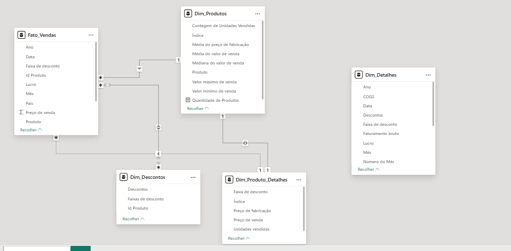

# Star Schema de Vendas com Power BI

Este repositório contém a modelagem em esquema estrela construída a partir do dataset `financial-sample.xlsx`, com foco em cenários de vendas.  
O objetivo é demonstrar boas práticas de modelagem dimensional no Power BI para suportar análises de vendas por produto, descontos, região e tempo.

## Fonte de dados

- Arquivo: `financial-sample.xlsx` (tabela única `financials` com ~700 linhas). 
- Principais colunas de origem: `Segmento`, `País`, `Produto`, `Faixa de desconto`, `Unidades vendidas`, `Preço de fabricação`, `Preço de venda`, `Faturamento bruto`, `Descontos`, `Vendas`, `Custo dos produtos vendidos (COGs)`, `Lucro`, `Data`, `Número do mês`, `Nome do mês`, `Ano`

## Modelagem em estrela

O modelo foi remodelado para um **Esquema Estrela (Star Schema)**, com uma tabela fato central e múltiplas dimensões ao redor.

### Fato_Vendas

Tabela fato principal, derivada da `financials`.

Campos principais:
- `Id Produto` (chave substituta para produto).  
- `Data`, `Ano`, `Mês`, `País`, `Segmento`, `Faixa de desconto`.  
- Métricas de negócio: `Unidades vendidas`, `Vendas` (Sales), `Preço de venda`, `Lucro`.  

Cada linha representa um evento de venda para um produto em uma data, país, segmento e faixa de desconto específicos.

### Dim_Produtos

Dimensão de produto construída a partir da agregação da fato.

Campos:
- `Índice` / `Id Produto` (chave da dimensão).  
- `Produto`.  
- Atributos resumidos por produto:
  - `Contagem de Unidades Vendidas` (soma de `Unidades vendidas`).  
  - `Média do preço de fabricação` (média de `Preço de fabricação`).  
  - `Valor mínimo de venda`, `Valor máximo de venda`.  
  - `Mediana do valor de vendas`, `Média do valor de vendas`.

Esses campos permitem análises de performance por produto sem recalcular os agregados na carga.

### Dim_Descontos

Dimensão associada às políticas de desconto.

Campos:
- `Id Produto` (quando necessário para detalhar por produto).  
- `Descontos` (valor).  
- `Faixas de desconto` (band, como “Low”, “Medium”, “High”).

Serve para segmentar indicadores por nível de desconto aplicado.

### Dim_Produto_Detalhes

Dimensão de apoio para atributos mais detalhados de produto e preço.

Campos:
- `Índice`.  
- `Faixa de desconto`.  
- `Preço de fabricação`.  
- `Preço de venda`.  
- `Unidades vendidas`.

Pode ser usada para análises mais granulares de variação de preço e unidades por produto/faixa.

### Dim_Detalhes

Dimensão “rich” para análises detalhadas cruzando medidas financeiras e tempo.

Campos:
- `Data`, `Ano`, `Mês`, `Número do Mês`.  
- `País`, `Segmento`, `Produto`.  
- Métricas derivadas: `Faturamento bruto`, `Vendas`, `COGS`, `Lucro`, `Descontos`, `Unidades vendidas`.

Embora contenha métricas, é usada aqui como dimensão de apoio para visuais detalhados e drill-down.

## Relacionamentos (DER)

O diagrama de entidades e relacionamentos no Power BI foi configurado com:

- `Fato_Vendas` no centro.  
- Relação 1:* de `Dim_Produtos` → `Fato_Vendas` via `Id Produto`.  
- Relações adicionais com:
  - `Dim_Descontos` (por faixa de desconto / produto).  
  - `Dim_Produto_Detalhes` (por produto/faixa).  
  - `Dim_Detalhes` (para enriquecer análises por data, país, segmento e métricas financeiras).

Todas as relações seguem o padrão **1 para muitos**, preservando a granularidade da fato e garantindo bom desempenho para filtros e agregações.

## Transformações no Power Query

Principais passos realizados no Power Query:

- **Criação da Fato_Vendas** a partir da tabela original, mantendo apenas colunas necessárias para o contexto de vendas.  
- **Criação de dimensões por duplicação e agrupamento**:
  - `Dim_Produtos`: `Agrupar por Produto` e calcular soma, média, mínima, máxima e mediana das colunas numéricas relevantes (por exemplo `Unidades vendidas`, `Preço de venda`, `Preço de Fabricação`).  
  - `Dim_Descontos` e `Dim_Produto_Detalhes`: derivadas de combinações de `Faixa de desconto`, `Produto`, preços e unidades.  
- **Criação de chaves substitutas (índices)**:
  - Uso de coluna de índice em dimensões (ex.: `Id Produto`) e posterior mesclagem com a fato para substituir nomes de texto por chaves numéricas. 

Essas transformações reduzem a cardinalidade, melhoram o tamanho do modelo e facilitam o relacionamento entre tabelas.

## Como usar o modelo

1. Abrir o arquivo `.pbix` no Power BI Desktop.  
2. Usar a tabela `Fato_Vendas` como base de medidas (Total de Vendas, Unidades Vendidas, Lucro etc.).  
3. Combinar com as dimensões:
   - `Dim_Produtos` para análises por produto e estatísticas agregadas.  
   - `Dim_Descontos` para cortes por faixa de desconto.  
   - `Dim_Produto_Detalhes` e `Dim_Detalhes` para visões mais detalhadas por preço, país, segmento e tempo.  
4. A partir desse modelo, criar páginas de dashboard (vendas por país, produto, mês, análise de desconto, lucratividade) com boa performance graças ao esquema em estrela. 

---

> Este projeto foca exclusivamente na **modelagem**; não há páginas de relatório prontas.  
> A ideia é servir como base para futuros dashboards de vendas seguindo boas práticas de Star Schema no Power BI.

